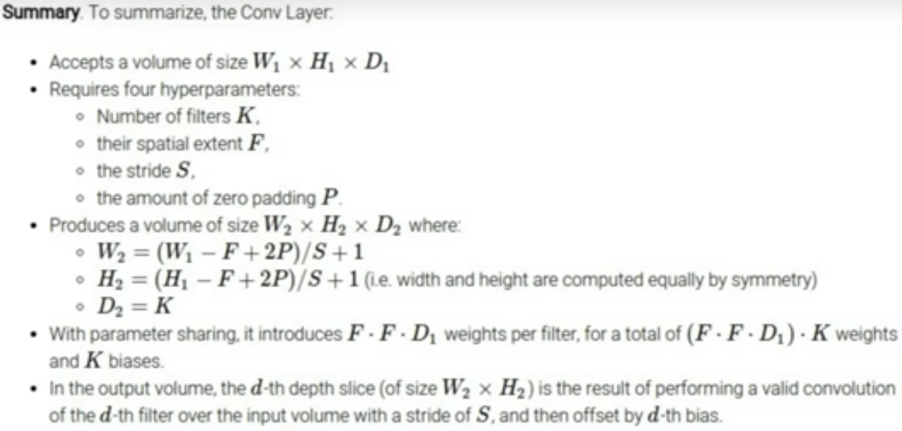

# CovNets

A way to preserve the **spatial representation** in the image. 

So, rather than stretching out the full pixels to 3072x1 vector, we now use a 3D vector
of size 32x32x3. 

Convolution is:
1. Taking a filter of size NxNxD, where depth D is similar to input size.
2. Dot multiplication or elementwise multiplication of fitler with input image.
3. Move along the width and height of the image with a decided stride.
4. Zero pad to preserve the information in the corners of the image.
5. Fully Connected layer at the end.

number of filters decides the depth of the new layer.

Filter gives the ability to look at the small local spatial data. Can be called the receptive field of the neuron.

# Why pooling
1. Downsample the data. Reduce number of parameters.
2. Scale and orientation invariance.

Why Max pooling and not average pooling?
Because we want to preserve the neurons that lead to higher excitation when lookinng for what we wanted to find. Those which fired with higher activation. So, max pooling preserves the highest activated neurons.

Ideas:
1. The receptive field should not be square. It should be a tuple of color connected regions.
2. Humans can find difference between 2 images when the difference is introduced while looking. bUt they fail to identify the difference when the image is removed, difference is introduced, and image is showed again.